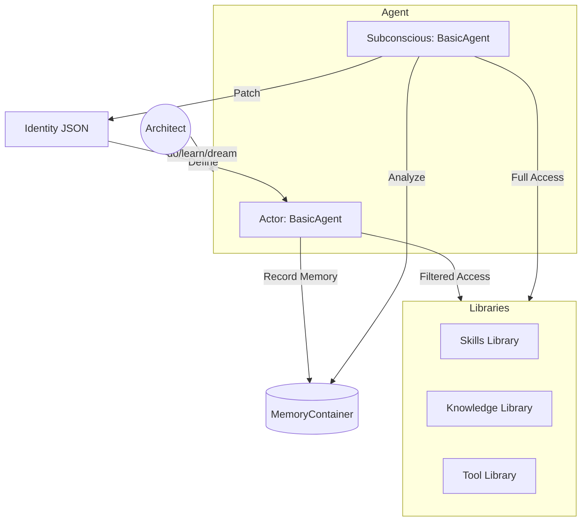

# CHAOS: Cognitive Hierarchical Adaptive OS

[](https://github.com/josef-dijon/chaos/actions/workflows/test.yml)

CHAOS is a framework for building self-improving, persistent digital entities using a dual-process theory of mind.

## 🧠 Philosophy

Human intelligence is not a single loop; it is a hierarchy. CHAOS implements this by splitting an Agent into two distinct processes:

1.  **The Actor:** The task-oriented "conscious" mind. It executes tasks, uses tools, and interacts with the world.
2.  **The Subconscious:** The background "hidden" mind. It reflects on the Actor's experiences, analyzes feedback, and patches the Actor's **Identity**.

This architecture ensures that agents don't just perform tasks—they **learn and adapt** over time without human intervention in the core loop.

## ✨ Key Features

- **Dual-Process Architecture:** Separation of execution (Actor) and reflection (Subconscious).
- **Persistent Identity:** Agents are defined by an `Identity` (JSON), which includes their profile, core values, and mutable operational instructions.
- **Modular Library System:**
    - **Skills Library:** Reusable prompt patterns and behavioral instructions.
    - **Knowledge Library:** RAG-based static reference material.
    - **Tool Library:** Executable capabilities (CLI, MCP, etc.).
- **Access Control:** The Identity can whitelist or blacklist specific Skills, Knowledge domains, or Tools to scope the agent's breadth.
- **Cognitive Loop:** Built on **LangGraph**, providing a robust cyclic reasoning engine (`Recall` -> `Reason` -> `Act`).
- **Memory Management:** Integrated Long-Term Memory (LTM via ChromaDB) and Short-Term Memory (STM via rolling buffer).

## 🏗 Architecture



Detailed technical specifications can be found in [docs/architecture.md](docs/architecture.md).

## 🚀 Getting Started

### Prerequisites
- Python 3.12+
- [uv](https://github.com/astral-sh/uv)

### Installation
```bash
uv sync
```

### Usage
1. **Initialize a new Agent Identity:**
   ```bash
   uv run python -m agent_of_chaos.cli.main init
   ```
2. **Execute a task:**
   ```bash
   uv run python -m agent_of_chaos.cli.main do "Research the project structure"
   ```
3. **Trigger a learning cycle:**
   ```bash
   uv run python -m agent_of_chaos.cli.main learn "You were too verbose in the last response."
   ```

## 📜 Development Standards

We follow strict development protocols to ensure high coverage and architectural integrity. See [AGENTS.md](AGENTS.md) for our contributor guide and workflow.
