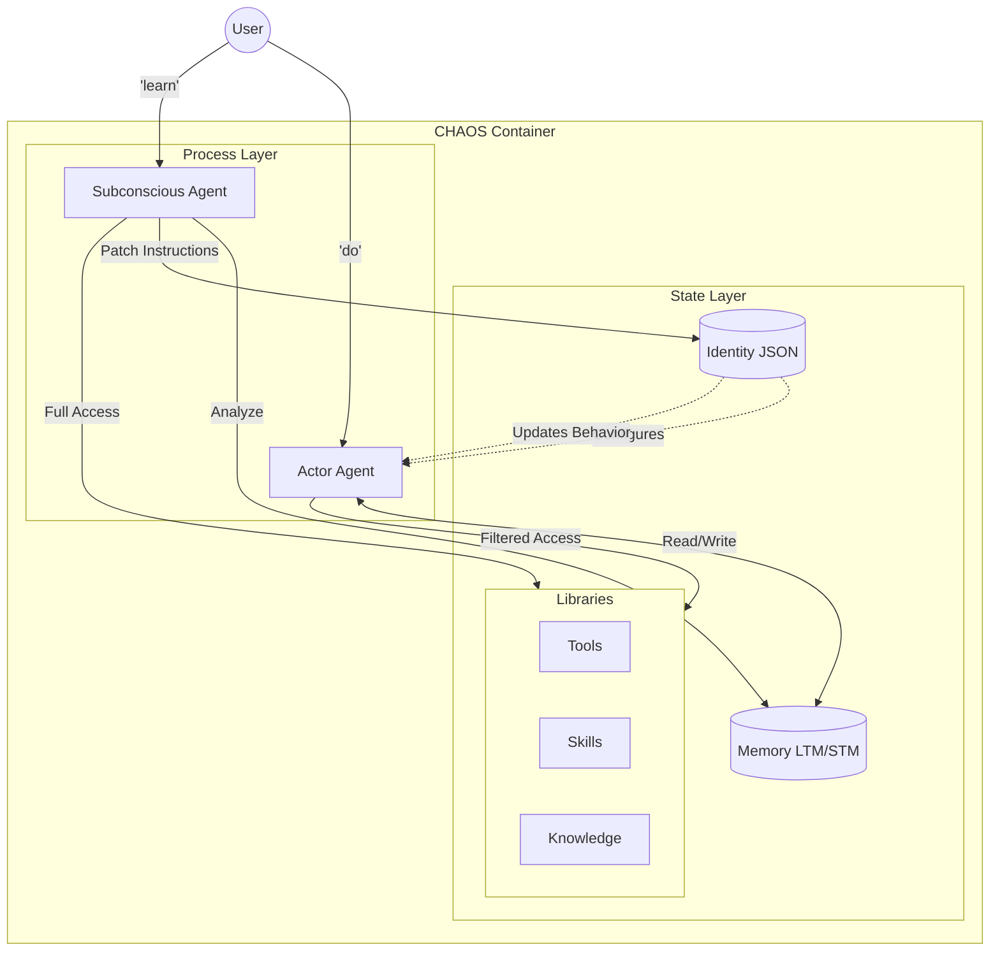

# CHAOS: Cognitive Hierarchical Adaptive OS

[](https://github.com/josef-dijon/chaos/actions/workflows/test.yml)

CHAOS is a framework for building persistent, self-correcting AI agents. It implements a **Dual-Process Architecture** that separates active task execution from background reflection.

## The Concept

Most AI agents operate in a single continuous loop. CHAOS splits the cognitive load into two distinct processes:

1.  **The Actor (System 1):** Fast, task-oriented execution. It focuses on using tools and solving the immediate problem using its current instructions.
2.  **The Subconscious (System 2):** Slow, reflective optimization. It analyzes the Actor's logs and user feedback to update the agent's core configuration, effectively "patching" the agent's behavior over time.

While "Hierarchical" is in the name, it refers to **Meta-Cognitive Control** rather than a tree of workers. The Subconscious operates on a meta-layer, governing the parameters and identity of the Actor.

## Key Features

- **Dual-Process Architecture:** An "Actor" for doing and a "Subconscious" for learning.
- **Persistent Identity:** Agents are defined by a JSON-based `Identity` containing their role, values, and mutable operational instructions.
- **Modular Libraries:**
    - **Skills:** Reusable prompt patterns.
    - **Knowledge:** RAG-based static reference material.
    - **Tools:** Executable capabilities.
- **Access Control:** The Identity acts as a permission scope, whitelisting/blacklisting specific libraries to constrain the Actor's focus.
- **Memory:** Integrated Long-Term Memory (Vector DB) and Short-Term Memory (Context Buffer).

## Architecture

The system distinguishes between **Processes** (The Agents) and **State** (Memory, Identity, Libraries).



Detailed technical specifications can be found in [docs/architecture.md](docs/architecture.md).

## Getting Started

### Prerequisites
- Python 3.12+
- [uv](https://github.com/astral-sh/uv)

### Installation
```bash
uv sync
```

### Usage
1. **Initialize a new Agent Identity:**
   ```bash
   uv run python -m agent_of_chaos.cli.main init
   ```
2. **Execute a task (The Actor):**
   ```bash
   uv run python -m agent_of_chaos.cli.main do "Research the project structure"
   ```
3. **Trigger a learning cycle (The Subconscious):**
   ```bash
   uv run python -m agent_of_chaos.cli.main learn "You were too verbose in the last response."
   ```

## Development Standards

We follow strict development protocols to ensure high coverage and architectural integrity. See [AGENTS.md](AGENTS.md) for our contributor guide and workflow.
