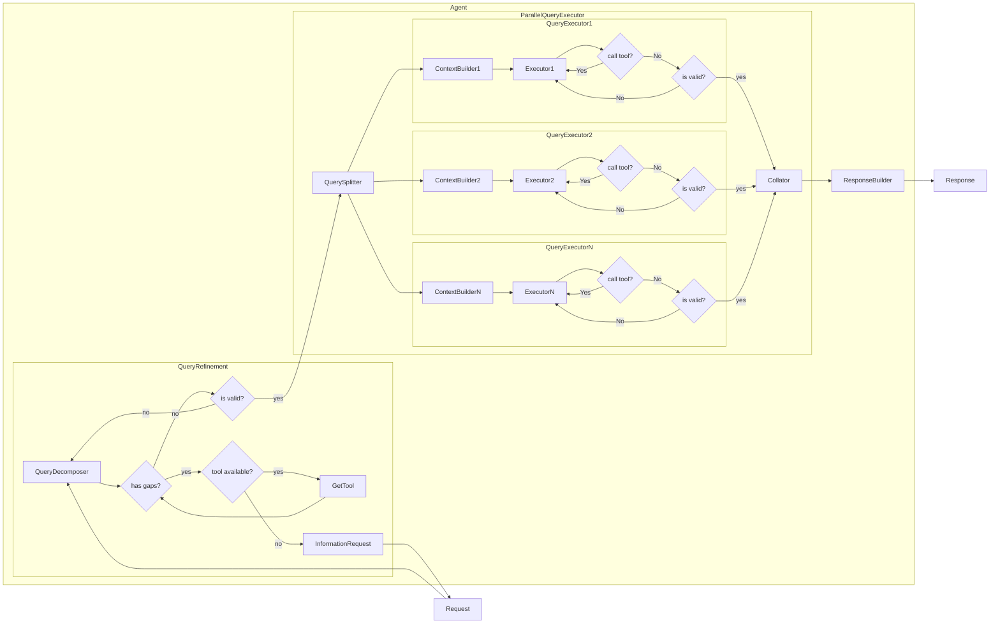

```mermaid
flowchart LR
    subgraph Agent
        subgraph QueryRefinement
            QueryDecomposer --> GapDetector{has gaps?}
            GapDetector --> |yes| ToolAvailable{tool available?}
            ToolAvailable --> |yes| GetTool
            GetTool --> GapDetector
            ToolAvailable --> |no| InformationRequest
            GapDetector --> |no| Validator{is valid?}
            Validator --> |no| QueryDecomposer
        end

        subgraph ParallelQueryExecutor
            subgraph QueryExecutor1
                ContextBuilder1 --> Executor1
                Executor1 --> ToolCaller1{call tool?}
                ToolCaller1 --> |Yes| Executor1
                ToolCaller1 --> |No| Validator1{is valid?}
                Validator1 --> |No| Executor1
            end

            subgraph QueryExecutor2
                ContextBuilder2 --> Executor2
                Executor2 --> ToolCaller2{call tool?}
                ToolCaller2 --> |Yes| Executor2
                ToolCaller2 --> |No| Validator2{is valid?}
                Validator2 --> |No| Executor2
            end

            subgraph QueryExecutorN
                ContextBuilderN --> ExecutorN
                ExecutorN --> ToolCallerN{call tool?}
                ToolCallerN --> |Yes| ExecutorN
                ToolCallerN --> |No| ValidatorN{is valid?}
                ValidatorN --> |No| ExecutorN
            end

            Validator --> |yes| QuerySplitter
            QuerySplitter --> ContextBuilder1
            Validator1 --> |yes| Collator
            QuerySplitter --> ContextBuilder2
            Validator2 --> |yes| Collator
            QuerySplitter --> ContextBuilderN
            ValidatorN --> |yes| Collator
        end

        Collator --> ResponseBuilder
    end
    
    InformationRequest --> Request
    Request --> QueryDecomposer
    ResponseBuilder --> Response
```
